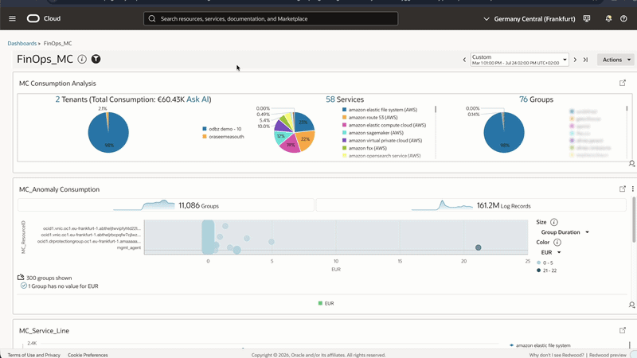
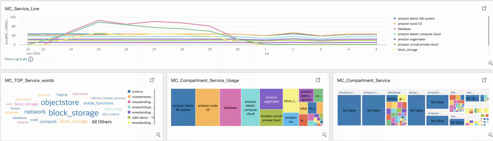

# Multicloud FinOps with Oracle Log Analytics

This project centralizes AWS and OCI FOCUS cost and usage data in Oracle Log Analytics, giving FinOps, engineering, and finance teams one shared view of cloud consumption.

*Multicloud dashboard. Image © Oracle, linked from the referenced blog post.*

## Business Value

Multicloud cost management is difficult when providers expose different account hierarchies, service names, SKUs, regions, and tags. FOCUS provides a common cost and usage specification; Oracle Log Analytics turns that data into one searchable and visual FinOps layer.

Stakeholders can move from a cost increase to the responsible provider, service, region, resource, SKU, and ownership group. Executives gain a clear view of spend trends and budget risk; application owners can investigate their workloads; and finance teams can support showback, chargeback, allocation, and variance analysis.

The dashboard also supports cost-driver analysis, anomaly investigation, and environment- or group-based filtering. The same normalized fields can be used for saved searches, alerts, and longer-term cost retention.

*Cost anomaly analysis. Image © Oracle, supplied from the referenced blog post.*

*Natural-language exploration with Logan AI. Image © Oracle, linked from the referenced blog post.*

## Dashboard Architecture

AWS Billing and Cost Management Data Exports publish FOCUS data to Amazon S3. Make the required FOCUS CSV or CSV.GZ files available in the private OCI Object Storage bucket created by this stack. The stack deliberately does not create an AWS function, scheduled job, cross-cloud credential, or data-transformation path; report delivery to OCI is owned by the existing export process.

The AWS FOCUS report lands in OCI Object Storage, where the `FOCUS_AWS` source and a Log Analytics object collection rule ingest it. OCI FOCUS data is parsed through `FOCUS_OCI`. Both providers then use the same normalized model beneath the `FinOps_MC` dashboard.

*Reference architecture. Image © Oracle, linked from the referenced blog post.*

*Consumption widget. Image © Oracle, supplied from the referenced blog post.*

The Terraform stack in [`terraform/`](terraform/) creates the OCI Object Storage bucket, onboards Log Analytics, imports `FOCUS_AWS` and the `FinOps_MC` dashboard, grants the required OCI policies, and enables a live Object Storage collection rule. The Log Analytics content exports remain in [`src/`](src/) as portable imports.

## Normalization Fields

The parsers map each provider report to stable `MC_*` fields. This separates the dashboard from provider-specific report versions, optional fields, and extensions.

| Normalized field | Meaning |
| --- | --- |
| `MC_CONSUMPTION` | Cost or consumption amount used for analysis |
| `MC_CURRENCY` | Billing currency |
| `MC_Hypervisor` | Source cloud or platform, such as AWS or OCI |
| `MC_REGION` | Usage region |
| `MC_SERVICE` | Cloud service |
| `MC_ResourceID` / `MC_ResourceName` | Resource identifier and display name |
| `MC_SKU` | SKU or metering dimension |
| `MC_ENVIRONMENT` | Environment classification |
| `MC_GROUP` | Allocation or ownership group |
| `MC_USAGE` | Usage measure exposed by the AWS parser |

The OCI parser includes `MC_GROUP`; add an equivalent AWS allocation mapping when business-unit reporting is needed. Owner, application, cost centre, tags, and commitment-discount detail can be added without changing the shared dashboard contract.

*Normalized field model. Image © Oracle, linked from the referenced blog post.*

## Included Assets

| Asset | Purpose |
| --- | --- |
| [`src/FOCUS_AWS.xml`](src/FOCUS_AWS.xml) | Log Analytics `FOCUS_AWS` parser and source export |
| [`src/FOCUS_OCI.xml`](src/FOCUS_OCI.xml) | Log Analytics `FOCUS_OCI` parser and source export |
| [`src/FinOps_MC.json`](src/FinOps_MC.json) | `FinOps_MC` dashboard export; six tiles and six saved searches |
| [`terraform/`](terraform/) | Resource Manager-ready OCI stack: bucket, Log Analytics imports, policies, stream, and live collection rule |
| [`terraform/finops-mc-oci-stack.zip`](terraform/finops-mc-oci-stack.zip) | Deployable OCI Resource Manager package |

## Deploy on Oracle Cloud

The button opens OCI Resource Manager's **Create stack** page using the published stack ZIP from the `finOpsMC` branch.

### Actions performed by the stack

- Creates a private, event-enabled OCI Object Storage bucket for AWS FOCUS reports.
- Onboards Oracle Log Analytics and creates a dedicated FOCUS log group.
- Imports the packaged `FOCUS_AWS` parser and source plus the `FinOps_MC` dashboard and saved searches.
- Creates the OCI Streaming resource, dynamic group, and IAM policies required for live Object Storage collection.
- Enables a LIVE Object Collection Rule that ingests files under the configured bucket prefix with the `FOCUS_AWS` source.

It does not create AWS resources, cross-cloud credentials, Functions, Lambda jobs, or report-export automation. Uploading or transferring FOCUS reports to the OCI bucket remains outside this stack.

## References

- [Monitoring FinOps Data Across Multicloud with Oracle Log Analytics](https://blogs.oracle.com/observability/monitor-finops-multicloud-oracle-log-analytics)
- [Observability for AWS FinOps Data with Oracle Log Analytics](https://blogs.oracle.com/observability/observability-aws-finops-data-oracle-log-analytics)
- [FOCUS specification](https://focus.finops.org/)
- [Collect Logs from Your OCI Object Storage Bucket](https://docs.oracle.com/en-us/iaas/log-analytics/doc/collect-logs-from-your-oci-object-storage-bucket.html)
- [Deploy to Oracle Cloud button documentation](https://docs.oracle.com/en-us/iaas/Content/ResourceManager/Tasks/deploybutton.htm)
